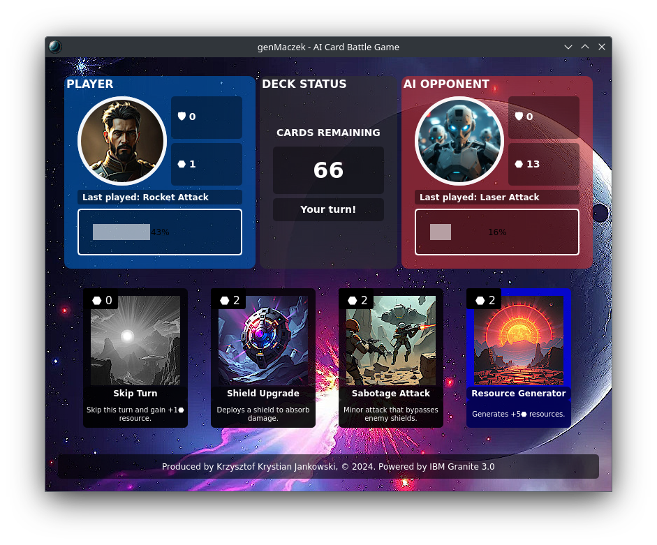

# genMaczek - AI Card Battle Game



## Overview
genMaczek is a strategic war card game where players take turns to outmaneuver and defeat their opponent by making tactical decisions. The game features both a human player and an AI opponent, each with their own deck of cards. The objective is to reduce the opponent's health to zero or have the highest health when all cards are used.

## Features
- **Turn-based gameplay**: Players take turns to play cards from their hand.
- **AI opponent**: The game includes an AI opponent that makes strategic decisions based on the game state.
- **Card effects**: Cards can have various effects such as attacking, healing, generating resources, and more.
- **Resource management**: Players must manage their resources to play cards effectively.
- **Dynamic UI**: The game features a dynamic user interface built with PyQt5.

## Installation
1. **Clone the repository**:
    ```sh
    git clone https://github.com/yourusername/genmaczek-ai-card-game.git
    cd genmaczek-ai-card-game
    ```

2. **Install dependencies**:
    ```sh
    pip install PyQt5 requests
    ```
3. **Run the server**:
    ```
    ollama serve
    ```
4. **Get model**:
    ```
    ollama pull granite3-dense
    ollama create granite3-dense -f Modelfile 
    ```
5. **Run the game**:
    ```sh
    python3 main.py
    ```

## How to Play
1. **Start the game**: Launch the game by running `python3 main.py`.
2. **Game setup**: The game initializes with both players drawing their initial hands.
3. **Player's turn**: The player can choose a card from their hand to play. Each card has a cost and an effect.
4. **AI's turn**: The AI opponent will make its move based on the current game state.
5. **End turn**: After playing a card, the turn ends, and the next player gets to play.
6. **Win condition**: The game ends when one player's health reaches zero or all cards are used. The player with the higher health wins.

## Card Types
- **Attack cards**: Deal damage to the opponent.
- **Defense cards**: Increase the player's defense to absorb damage.
- **Healing cards**: Restore the player's health.
- **Resource cards**: Generate additional resources for the player.
- **Special cards**: Have unique effects such as skipping the opponent's turn.

## AI Strategy
The AI opponent uses a model to decide its moves based on the game state. It considers factors such as available resources, health, and the cards in hand to make strategic decisions.

## Contributing
Contributions are welcome! If you have any ideas, suggestions, or bug reports, please open an issue or submit a pull request.

## License
This project is licensed under the MIT License. See the [LICENSE](LICENSE) file for details.

## Acknowledgements
- Powered by IBM Granite 3.0
- Developed by Krzysztof Krystian Jankowski